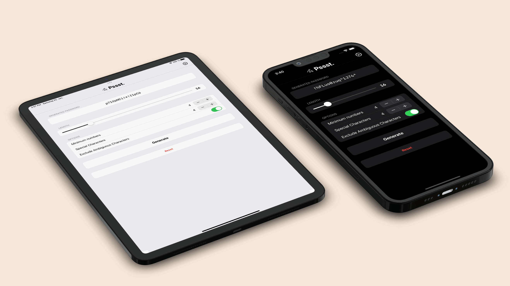
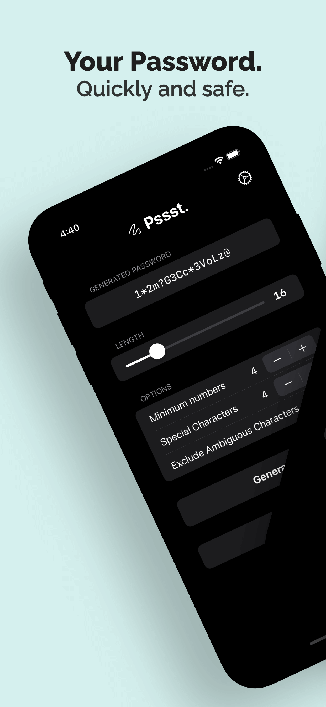
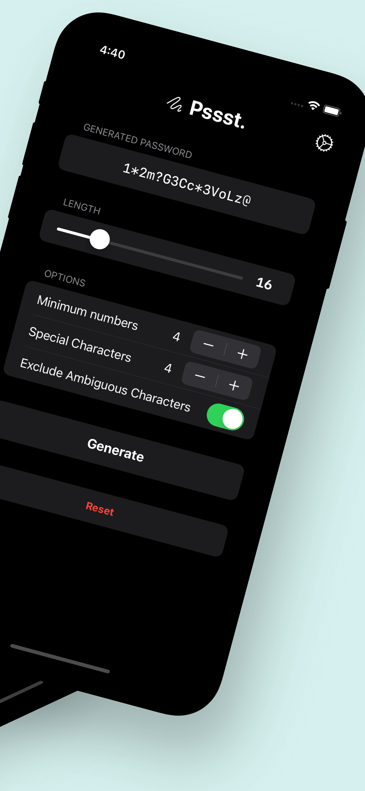
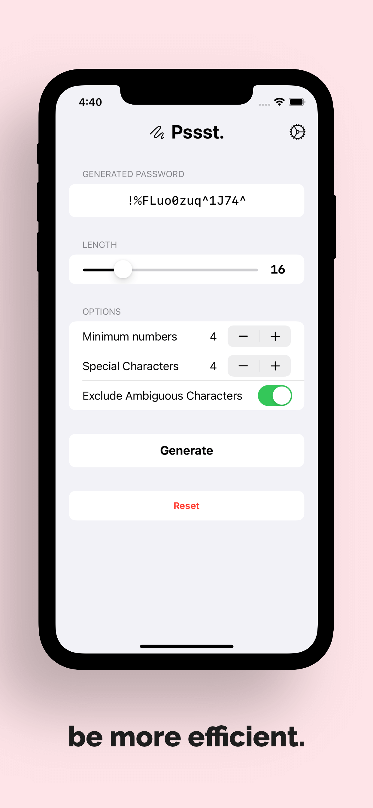

  

    <h3 class="my-2">Create your next password.  Quickly and safe.</h3>
  

  

    <a href="{{ site.app_store.link }}" target="_blank">
      <picture>
        <source srcset="assets/app_store_badge_dark.svg" media="(prefers-color-scheme: dark)">
        
      </picture>
    </a>
  

  

    
  

  

    
  

  

    
  

  

    
  

